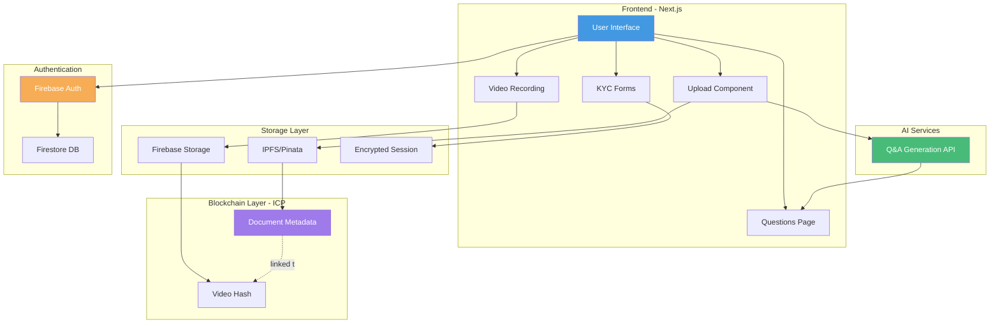

# EviBlock - Blockchain Document Verification Platform

<div align="center">


**Building the future of blockchain technology with cutting-edge document verification solutions**

[](https://nextjs.org/)
[](https://www.typescriptlang.org/)
[](https://firebase.google.com/)
[](https://internetcomputer.org/)

[Features](#features) • [Architecture](#architecture) • [Getting Started](#getting-started) • [Documentation](#documentation)

</div>

---

## 📋 Table of Contents

- [Overview](#overview)
- [Features](#features)
- [Architecture](#architecture)
- [Tech Stack](#tech-stack)
- [Getting Started](#getting-started)
- [Document Types](#document-types)
- [Project Structure](#project-structure)
- [Environment Setup](#environment-setup)
- [Development](#development)
- [Deployment](#deployment)
- [API Documentation](#api-documentation)
- [Contributing](#contributing)
- [License](#license)

---

## 🌟 Overview

**EviBlock** is a decentralized document verification platform built on the Internet Computer Protocol (ICP) blockchain. It provides multi-tier KYC verification with immutable blockchain storage, IPFS-based document storage, and AI-powered verification questions.

Our platform ensures that your documents are:
- ✅ **Cryptographically secured** with AES-256 encryption
- ✅ **Immutably stored** on the blockchain
- ✅ **Video-verified** with your real identity
- ✅ **Tamper-proof** with hash-based integrity checks
- ✅ **Decentralized** using IPFS for file storage

---

## 🚀 Features

### 🔐 Multi-Tier Verification System

EviBlock offers three security tiers to match your document's importance:

| Tier | Description | KYC Required | Video Verification | AI Questions | Use Cases |
|------|-------------|--------------|-------------------|--------------|-----------|
| **Simple** | Basic storage | Mini-KYC only | ❌ No | ❌ No | Personal notes, drafts |
| **Evidence** | Identity-linked | ✅ Full KYC | ✅ Yes | ❌ No | Contracts, agreements |
| **Legal** | Government-grade | ✅ Full KYC | ✅ Yes | ✅ Yes | Legal docs, certificates |

### 🎯 Core Features

- **🔒 End-to-End Encryption**: AES-256 encryption for all sensitive KYC data
- **🎥 Video KYC Verification**: Record video proof linking documents to your identity
- **🤖 AI-Generated Questions**: Legal documents verified with AI-powered questions from document content
- **📦 IPFS Storage**: Decentralized file storage via Pinata
- **⛓️ Blockchain Immutability**: All metadata stored on Internet Computer blockchain
- **🔗 Cryptographic Linking**: Documents linked to video proofs via blockchain
- **🌐 Secure Session Management**: Auto-expiring encrypted sessions
- **📧 Email Verification**: Firebase Authentication with email/password
- **🎨 Modern UI**: Beautiful, responsive design with Tailwind CSS and Shadcn UI

---

## 🏗️ Architecture



### Data Flow

#### Simple Documents (Fast Path)
```
Upload → IPFS → Blockchain → Dashboard
```

#### Evidence Documents (Medium Path)
```
KYC Form → Upload → IPFS → Video Verification → Blockchain → Dashboard
```

#### Legal Documents (Full Path)
```
KYC Form → Upload → IPFS → Q&A Generation (Async) → Video Verification → AI Questions → Blockchain → Dashboard
```

---

## 🛠️ Tech Stack

### Frontend
- **Framework**: [Next.js 16](https://nextjs.org/) (App Router)
- **Language**: [TypeScript 5](https://www.typescriptlang.org/)
- **Styling**: [Tailwind CSS 4](https://tailwindcss.com/)
- **UI Components**: [Shadcn UI](https://ui.shadcn.com/) + [Radix UI](https://www.radix-ui.com/)
- **Animations**: [Framer Motion](https://www.framer.com/motion/), [GSAP](https://gsap.com/)
- **3D Graphics**: [React Three Fiber](https://docs.pmnd.rs/react-three-fiber)

### Backend & Blockchain
- **Blockchain**: [Internet Computer Protocol (ICP)](https://internetcomputer.org/)
- **Smart Contracts**: Rust Canisters
- **Agent**: [@dfinity/agent](https://www.npmjs.com/package/@dfinity/agent)

### Storage
- **File Storage**: [IPFS via Pinata](https://www.pinata.cloud/)
- **Database**: [Firebase Firestore](https://firebase.google.com/docs/firestore)
- **Media Storage**: [Firebase Storage](https://firebase.google.com/docs/storage)
- **Local Storage**: IndexedDB (video blobs), Encrypted SessionStorage (KYC data)

### Security & Encryption
- **KYC Encryption**: AES-256-GCM (Web Crypto API)
- **Video Hash**: SHA-256
- **Authentication**: [Firebase Authentication](https://firebase.google.com/docs/auth)

### External APIs
- **Q&A Generation**: Custom AI API (Python/ML backend)
- **Email**: [Nodemailer](https://nodemailer.com/)

---

## 🚦 Getting Started

### Prerequisites

- **Node.js**: v20 or higher
- **npm/yarn/pnpm**: Latest version
- **dfx**: Internet Computer SDK ([Install Guide](https://internetcomputer.org/docs/current/developer-docs/setup/install))
- **Firebase Account**: For authentication and storage
- **Pinata Account**: For IPFS storage

### Installation

1. **Clone the repository**
   ```bash
   git clone https://github.com/yourusername/Eviblockv2.0.git
   cd Eviblockv2.0
   ```

2. **Install dependencies**
   ```bash
   cd src/evilblock_frontend
   npm install
   ```

3. **Set up environment variables**
   
   Copy `.env.example` to `.env.local` and fill in your values:
   ```bash
   cp .env.example .env.local
   ```

   Required environment variables:
   ```env
   # Firebase
   NEXT_PUBLIC_FIREBASE_API_KEY=your_firebase_api_key
   NEXT_PUBLIC_FIREBASE_AUTH_DOMAIN=your_project.firebaseapp.com
   NEXT_PUBLIC_FIREBASE_PROJECT_ID=your_project_id
   NEXT_PUBLIC_FIREBASE_STORAGE_BUCKET=your_project.appspot.com
   NEXT_PUBLIC_FIREBASE_MESSAGING_SENDER_ID=your_sender_id
   NEXT_PUBLIC_FIREBASE_APP_ID=your_app_id

   # Pinata (IPFS)
   NEXT_PUBLIC_PINATA_API_KEY=your_pinata_api_key
   NEXT_PUBLIC_PINATA_SECRET_API_KEY=your_pinata_secret_key
   NEXT_PUBLIC_PINATA_JWT=your_pinata_jwt_token

   # Internet Computer
   NEXT_PUBLIC_BACKEND_CANISTER_ID=your_backend_canister_id
   NEXT_PUBLIC_IC_HOST=https://ic0.app

   # Q&A Generation API
   NEXT_PUBLIC_QA_API_URL=http://localhost:9000

   # Email
   NEXT_PUBLIC_MAIL_USER=your_email@example.com

   # Application
   NEXT_PUBLIC_APP_URL=http://localhost:3000
   ```

4. **Start the IC local replica** (in project root)
   ```bash
   dfx start --background
   ```

5. **Deploy canisters**
   ```bash
   dfx deploy
   ```

6. **Run the development server**
   ```bash
   cd src/evilblock_frontend
   npm run dev
   ```

7. **Open your browser**
   
   Navigate to [http://localhost:3000](http://localhost:3000)

---

## 📁 Document Types

### 🟢 Simple Documents
- **Purpose**: Quick storage without identity verification
- **Requirements**: Mini-KYC (name, email)
- **Process**: Upload → Blockchain → Done
- **Use Cases**: Personal notes, drafts, non-sensitive documents

### 🟡 Evidence Documents
- **Purpose**: Identity-linked document storage
- **Requirements**: Full KYC + Video Verification
- **Process**: KYC → Upload → Video → Blockchain
- **Use Cases**: Contracts, agreements, business documents

### 🔴 Legal Documents
- **Purpose**: Government-grade verification
- **Requirements**: Full KYC + Video + AI Questions
- **Process**: KYC → Upload → Video → Document-Specific Questions → Blockchain
- **Use Cases**: Legal contracts, government documents, certificates

---

## 📂 Project Structure

```
evilblock/
├── src/
│   ├── evilblock_backend/          # Rust canisters
│   │   └── src/
│   │       └── lib.rs              # Main canister logic
│   │
│   └── evilblock_frontend/         # Next.js frontend
│       ├── app/                    # App router pages
│       │   ├── api/                # API routes
│       │   ├── kyc/                # KYC flow pages
│       │   │   ├── page.tsx        # KYC form
│       │   │   ├── video-verification/
│       │   │   └── questions/      # Legal-only questions
│       │   ├── upload/             # Document upload
│       │   ├── dashboard/          # User dashboard
│       │   └── about/              # About/landing page
│       │
│       ├── components/             # React components
│       │   ├── ui/                 # Shadcn UI components
│       │   ├── FileUploadForm.tsx
│       │   └── FileUploadDropzone.tsx
│       │
│       ├── lib/                    # Utilities & helpers
│       │   ├── firebase/           # Firebase config
│       │   ├── canister.ts         # ICP blockchain interactions
│       │   ├── ipfs.ts             # IPFS/Pinata integration
│       │   ├── encryption.ts       # AES-256 encryption
│       │   ├── secureStorage.ts    # Encrypted session storage
│       │   ├── kycCleanup.ts       # KYC data cleanup
│       │   └── qaApi.ts            # Q&A generation API
│       │
│       ├── hooks/                  # Custom React hooks
│       ├── types/                  # TypeScript types
│       └── public/                 # Static assets
│
├── dfx.json                        # ICP configuration
├── Cargo.toml                      # Rust dependencies
└── README.md                       # This file
```

---

## ⚙️ Environment Setup

### Firebase Setup

1. Create a Firebase project at [console.firebase.google.com](https://console.firebase.google.com/)
2. Enable **Email/Password Authentication**
3. Create **Firestore Database** (Start in production mode)
4. Enable **Firebase Storage**
5. Copy your Firebase config to `.env.local`

### Pinata Setup

1. Create account at [pinata.cloud](https://www.pinata.cloud/)
2. Generate API keys
3. Add keys to `.env.local`

### Internet Computer Setup

1. Install dfx: `sh -ci "$(curl -fsSL https://internetcomputer.org/install.sh)"`
2. Start local replica: `dfx start --background`
3. Deploy canisters: `dfx deploy`
4. Copy canister ID to `.env.local`

### Q&A API Setup (Optional - for Legal documents)

The Q&A generation API is required only for legal document verification:

1. Set up your Q&A generation API server
2. Ensure it accepts `POST /generate-questions` with multipart/form-data
3. Expected response format:
   ```json
   {
     "success": true,
     "data": {
       "questions": [
         { "q": "Question text?", "a": "Answer text" }
       ]
     }
   }
   ```
4. Add API URL to `.env.local`: `NEXT_PUBLIC_QA_API_URL=http://your-api-url`

---

## 💻 Development

### Run Development Server

```bash
cd src/evilblock_frontend
npm run dev
```

Open [http://localhost:3000](http://localhost:3000)

### Build for Production

```bash
npm run build
npm start
```

### Lint Code

```bash
npm run lint
```

### Deploy to Internet Computer

```bash
# Build and deploy
dfx deploy --network ic

# Deploy specific canister
dfx deploy evilblock_backend --network ic
```

---

## 🚀 Deployment

### Vercel (Frontend)

1. Push code to GitHub
2. Import project to [Vercel](https://vercel.com)
3. Add environment variables
4. Deploy

### Internet Computer (Backend)

```bash
# Deploy to mainnet
dfx deploy --network ic

# Check canister status
dfx canister --network ic status evilblock_backend
```

---

## 📖 API Documentation

### Blockchain Canister Methods

#### `storeDocumentMetadata`
Store document metadata on blockchain

**Parameters:**
- `name`: string - Document name
- `uid`: string - User ID
- `date`: string - Upload date
- `file_type`: string - MIME type
- `file_size`: number - File size in bytes
- `cid`: string - IPFS Content ID
- `kyc_detail`: string - Encrypted KYC data
- `document_type`: string - "simple" | "evidence" | "legal"

#### `storeVideoVerification`
Store video verification hash on blockchain

**Parameters:**
- `uid`: string - User ID
- `video_hash`: string - SHA-256 hash of video
- `firestore_doc_id`: string - Firestore document ID

#### `linkVideoToDocument`
Link video verification to document on blockchain

**Parameters:**
- `video_id`: number - Video record ID
- `document_cid`: string - Document CID

### Q&A Generation API

#### `POST /generate-questions`

Generate verification questions from uploaded document

**Request:**
```
Content-Type: multipart/form-data
```

**Parameters:**
- `file`: File - PDF or image file
- `num_questions`: number (optional) - Number of questions (1-50, default: 5)
- `languages`: string (optional) - OCR languages (default: "eng")

**Response:**
```json
{
  "success": true,
  "data": {
    "questions": [
      {
        "q": "What is the main topic of the document?",
        "a": "The main topic is..."
      }
    ]
  }
}
```

---

## 🔒 Security Features

- **AES-256-GCM Encryption**: All KYC data encrypted before storage
- **SHA-256 Hashing**: Video integrity verification
- **Secure Session Management**: Auto-expiring encrypted sessions (30 minutes)
- **Video Integrity Checks**: Hash validation before upload
- **Blockchain Immutability**: Tamper-proof metadata storage
- **IPFS Content Addressing**: File integrity via CID
- **Firebase Auth**: Secure email/password authentication
- **HTTPS Only**: Secure communication in production

---

## 🤝 Contributing

We welcome contributions! Please follow these steps:

1. Fork the repository
2. Create a feature branch (`git checkout -b feature/AmazingFeature`)
3. Commit your changes (`git commit -m 'Add some AmazingFeature'`)
4. Push to the branch (`git push origin feature/AmazingFeature`)
5. Open a Pull Request

---

## 📜 License

This project is licensed under the MIT License - see the [LICENSE](LICENSE) file for details.

---

## 🙏 Acknowledgments

- [Internet Computer](https://internetcomputer.org/) - Blockchain infrastructure
- [Pinata](https://www.pinata.cloud/) - IPFS gateway
- [Firebase](https://firebase.google.com/) - Authentication and storage
- [Shadcn UI](https://ui.shadcn.com/) - UI components
- [Next.js](https://nextjs.org/) - React framework

---

## 📞 Support

For support, email [your-email@example.com](mailto:your-email@example.com) or join our [Discord community](#).

---

<div align="center">

**Built with ❤️ by the EviBlock Team**

[Website](#) • [Documentation](#) • [Twitter](#) • [Discord](#)

</div>
