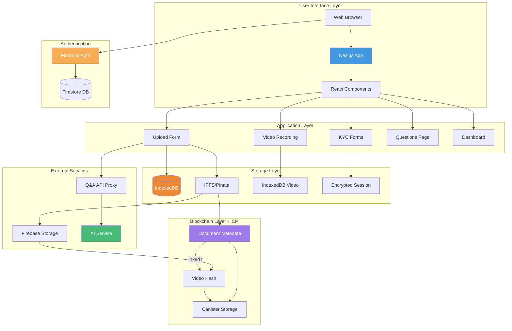
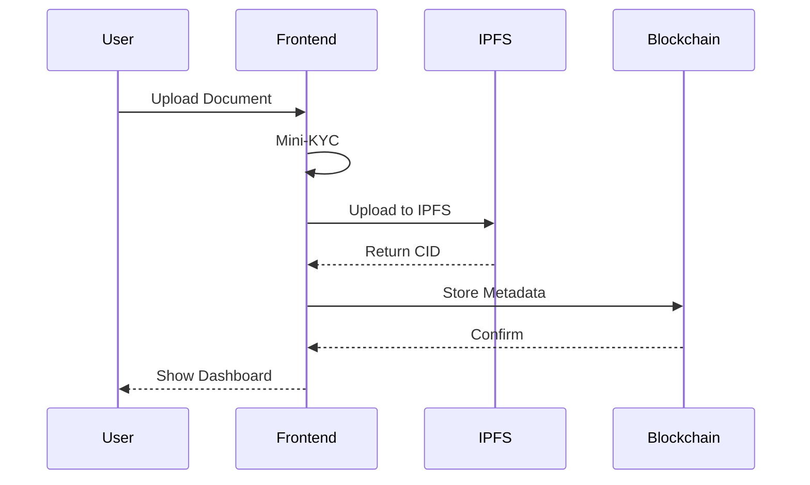
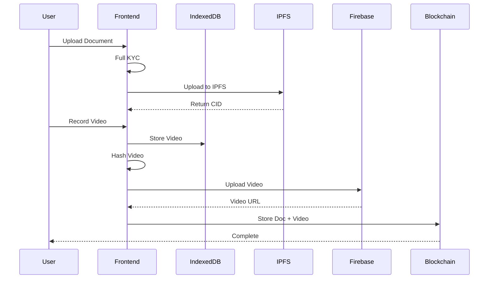
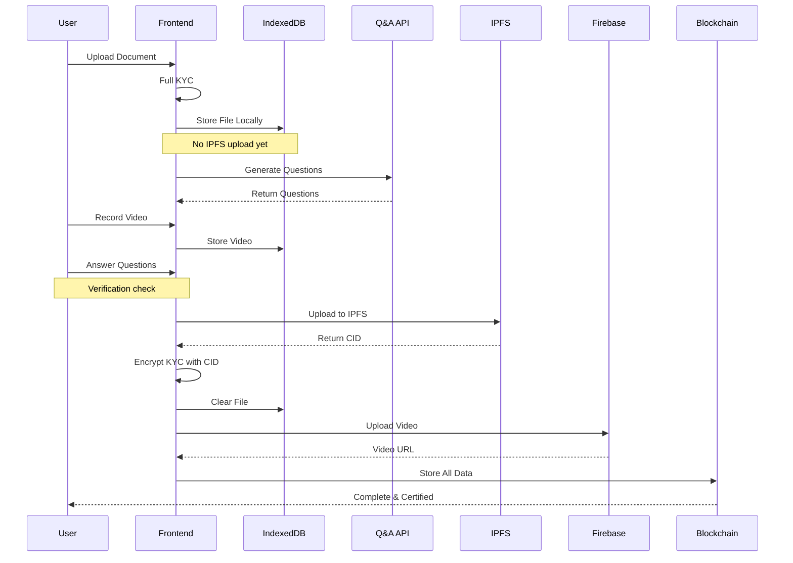
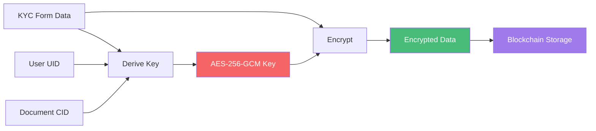
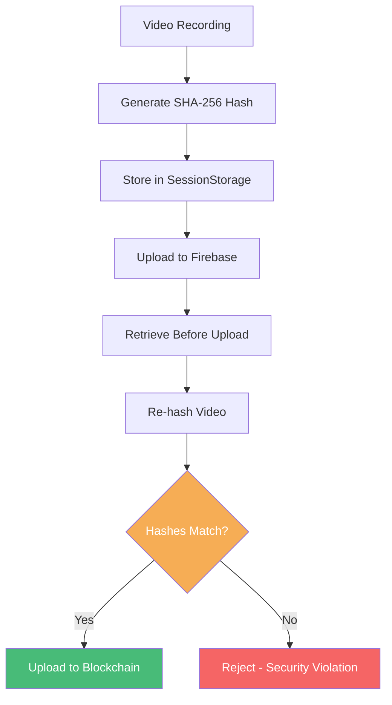
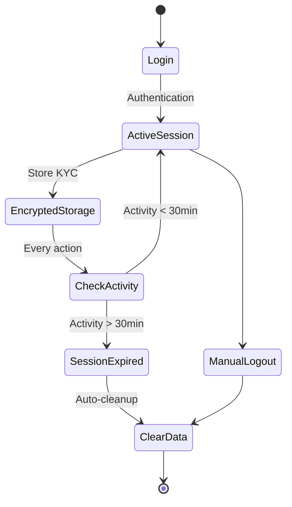

# EviBlock - Blockchain Document Verification Platform

<div align="center">


**Building the future of blockchain technology with cutting-edge document verification solutions**

[](https://nextjs.org/)
[](https://www.typescriptlang.org/)
[](https://firebase.google.com/)
[](https://internetcomputer.org/)

[Features](#-features) • [Architecture](#-architecture) • [Security](#-security) • [Getting Started](#-getting-started) • [Documentation](#-documentation)

</div>

---

## 📋 Table of Contents

- [Overview](#-overview)
- [Features](#-features)
- [Architecture](#-architecture)
  - [System Architecture](#system-architecture)
  - [Document Upload Flow](#document-upload-flow)
  - [Security Architecture](#security-architecture)
- [Tech Stack](#-tech-stack)
- [Getting Started](#-getting-started)
- [Document Types](#-document-types)
- [Project Structure](#-project-structure)
- [Environment Setup](#-environment-setup)
- [Development](#-development)
- [API Documentation](#-api-documentation)
- [Security](#-security)
- [Deployment](#-deployment)
- [Contributing](#-contributing)

---

## 🌟 Overview

**EviBlock** is a decentralized document verification platform built on the Internet Computer Protocol (ICP) blockchain. It provides multi-tier KYC verification with immutable blockchain storage, IPFS-based document storage, and **AI-powered verification questions** for legal documents.

### Why EviBlock?

Our platform ensures that your documents are:
- ✅ **Cryptographically secured** with AES-256-GCM encryption
- ✅ **Immutably stored** on the ICP blockchain
- ✅ **Video-verified** linking documents to your real identity
- ✅ **AI-verified** with document-specific questions (legal tier)
- ✅ **Tamper-proof** with SHA-256 hash integrity checks
- ✅ **Decentralized** using IPFS for file storage
- ✅ **Privacy-first** with session-based encrypted KYC data

---

## 🚀 Features

### 🔐 Multi-Tier Verification System

EviBlock offers three security tiers to match your document's importance:

| Tier | Description | KYC Required | Video Verification | AI Questions | IPFS Upload Timing | Use Cases |
|------|-------------|--------------|-------------------|--------------|-------------------|-----------|
| **Simple** | Basic storage | Mini-KYC only | ❌ No | ❌ No | Immediate | Personal notes, drafts |
| **Evidence** | Identity-linked | ✅ Full KYC | ✅ Yes | ❌ No | Immediate | Contracts, agreements |
| **Legal** | Government-grade | ✅ Full KYC | ✅ Yes | ✅ Yes | **After Q&A verification** | Legal docs, certificates |

### 🎯 Core Features

#### Security & Encryption
- **🔒 AES-256-GCM Encryption**: All KYC data encrypted with unique UID+CID keys
- **🔑 Secure Key Derivation**: Encryption keys derived from user ID + document CID
- **⏱️ Session Management**: Auto-expiring encrypted sessions (30 minutes inactivity timeout)
- **🧹 Auto-Cleanup**: Sensitive data cleared on page unload and completion

#### Document Verification
- **🎥 Video KYC Verification**: Record video proof linking documents to your identity
- **🤖 AI-Generated Questions**: Legal documents verified with questions extracted from content
- **📊 Multi-Format Support**: Supports both Q&A and True/False questions
- **🔀 Question Randomization**: Questions shuffled for security

#### Storage & Blockchain
- **📦 IPFS Storage**: Decentralized file storage via Pinata
- **⛓️ ICP Blockchain**: Immutable metadata storage on Internet Computer
- **🔗 Cryptographic Linking**: Documents linked to video proofs via blockchain
- **🎯 Deferred Upload**: Legal documents uploaded ONLY after verification (prevents orphaned files)

#### User Experience
- **🎨 Modern UI**: Beautiful, responsive design with Tailwind CSS and Shadcn UI
- **📧 Email Verification**: Firebase Authentication with email/password
- **📱 Progressive Security**: Choose your verification level based on document importance
- **🌐 Real-time Progress**: Clear status indicators throughout the process

##3 🏗 Architecture

### System Architecture



### Document Upload Flow

#### Simple Documents (Fast Path)


#### Evidence Documents (Medium Path)


#### Legal Documents (Full Verification Path) - NEW FLOW


### Security Architecture

#### KYC Data Encryption Flow


#### Video Integrity Verification


#### Session Security Model


---

## 🛠️ Tech Stack

### Frontend
- **Framework**: [Next.js 16](https://nextjs.org/) (App Router, Server Components)
- **Language**: [TypeScript 5](https://www.typescriptlang.org/)
- **Styling**: [Tailwind CSS 4](https://tailwindcss.com/)
- **UI Components**: [Shadcn UI](https://ui.shadcn.com/) + [Radix UI](https://www.radix-ui.com/)
- **Animations**: [Framer Motion](https://www.framer.com/motion/), [GSAP](https://gsap.com/)
- **3D Graphics**: [React Three Fiber](https://docs.pmnd.rs/react-three-fiber)
- **Forms**: React Hook Form + Zod validation

### Backend & Blockchain
- **Blockchain**: [Internet Computer Protocol (ICP)](https://internetcomputer.org/)
- **Smart Contracts**: Rust Canisters
- **Agent**: [@dfinity/agent](https://www.npmjs.com/package/@dfinity/agent)
- **Principal Management**: Internet Identity integration

### Storage
- **File Storage**: [IPFS via Pinata](https://www.pinata.cloud/)
- **Database**: [Firebase Firestore](https://firebase.google.com/docs/firestore)
- **Media Storage**: [Firebase Storage](https://firebase.google.com/docs/storage)
- **Local Storage**: 
  - IndexedDB (file blobs, video blobs)
  - Encrypted SessionStorage (KYC data with auto-expiry)

### Security & Encryption
- **KYC Encryption**: AES-256-GCM (Web Crypto API)
- **Key Derivation**: SHA-256 based on UID + CID
- **Video Hash**: SHA-256 for integrity verification
- **Authentication**: [Firebase Authentication](https://firebase.google.com/docs/auth)
- **Session Security**: Time-based encryption with 30-minute timeout

### External APIs
- **Q&A Generation**: Custom AI API (Python/ML backend)
  - Supports both Q&A and True/False questions
  - PDF and image OCR support
  - Proxied through Next.js API routes for CORS
- **Email**: [Nodemailer](https://nodemailer.com/)

---

## 🚦 Getting Started

### Prerequisites

- **Node.js**: v20 or higher
- **npm/yarn/pnpm**: Latest version
- **dfx**: Internet Computer SDK ([Install Guide](https://internetcomputer.org/docs/current/developer-docs/setup/install))
- **Firebase Account**: For authentication and storage
- **Pinata Account**: For IPFS storage
- **Q&A API** (Optional): For legal document questions

### Quick Start

1. **Clone the repository**
   ```bash
   git clone https://github.com/vibhasdutta/EviBlockv2.0.git
   cd EviBlockv2.0
   ```

2. **Install dependencies**
   ```bash
   cd src/evilblock_frontend
   npm install
   ```

3. **Set up environment variables**
   
   Create `.env.local` in `src/evilblock_frontend/`:
   ```env
   # Firebase
   NEXT_PUBLIC_FIREBASE_API_KEY=your_key
   NEXT_PUBLIC_FIREBASE_AUTH_DOMAIN=your_domain
   NEXT_PUBLIC_FIREBASE_PROJECT_ID=your_id
   NEXT_PUBLIC_FIREBASE_STORAGE_BUCKET=your_bucket
   NEXT_PUBLIC_FIREBASE_MESSAGING_SENDER_ID=your_sender
   NEXT_PUBLIC_FIREBASE_APP_ID=your_app_id

   # Pinata (IPFS)
   NEXT_PUBLIC_PINATA_API_KEY=your_key
   NEXT_PUBLIC_PINATA_SECRET_API_KEY=your_secret
   NEXT_PUBLIC_PINATA_JWT=your_jwt

   # Internet Computer
   NEXT_PUBLIC_BACKEND_CANISTER_ID=your_canister_id
   NEXT_PUBLIC_IC_HOST=https://ic0.app

   # Q&A Generation API
   NEXT_PUBLIC_QA_API_URL=http://localhost:9000

   # Email  
   NEXT_PUBLIC_MAIL_USER=your_email@example.com

   # Application
   NEXT_PUBLIC_APP_URL=http://localhost:3000
   ```

4. **Start IC local replica**
   ```bash
   dfx start --background
   ```

5. **Deploy canisters**
   ```bash
   dfx deploy
   ```

6. **Run development server**
   ```bash
   cd src/evilblock_frontend
   npm run dev
   ```

7. **Open browser**
   
   Navigate to [http://localhost:3000](http://localhost:3000)

---

## 📁 Document Types

### 🟢 Simple Documents
- **Purpose**: Quick storage without identity verification
- **Requirements**: Mini-KYC (name, email)
- **Process**: Upload → IPFS → Blockchain → Done (< 1 minute)
- **Use Cases**: Personal notes, drafts, non-sensitive documents
- **Storage**: Immediate IPFS upload

### 🟡 Evidence Documents  
- **Purpose**: Identity-linked document storage
- **Requirements**: Full KYC + Video Verification
- **Process**: KYC → Upload → IPFS → Video → Blockchain (~ 3-5 minutes)
- **Use Cases**: Contracts, agreements, business documents
- **Storage**: Immediate IPFS upload

### 🔴 Legal Documents
- **Purpose**: Government-grade verification with AI validation
- **Requirements**: Full KYC + Video + AI Questions
- **Process**: KYC → Local Storage → Q&A Gen → Video → Questions → IPFS → Blockchain (~ 5-7 minutes)
- **Use Cases**: Legal contracts, government documents, certificates, affidavits
- **Storage**: **Deferred IPFS upload** (after verification)
- **AI Features**: 
  - Document content analysis
  - Auto-generated questions (Q&A + True/False)
  - Question randomization
  - Answer validation

---

## 📂 Project Structure

```
evilblock/
├── src/
│   ├── evilblock_backend/          # Rust canisters
│   │   └── src/
│   │       └── lib.rs              # Blockchain logic
│   │
│   └── evilblock_frontend/         # Next.js frontend
│       ├── app/                    # App router pages
│       │   ├── api/                # API routes
│       │   │   └── qa/             # Q&A API proxy
│       │   ├── kyc/                # KYC flow pages
│       │   │   ├── page.tsx        # KYC form
│       │   │   ├── video-verification/
│       │   │   └── questions/      # Legal-only Q&A
│       │   ├── upload/             # Document upload
│       │   ├── dashboard/          # User dashboard
│       │   └── about/              # Landing page
│       │
│       ├── components/             # React components
│       │   ├── ui/                 # Shadcn UI
│       │   ├── FileUploadForm.tsx  # Main upload logic
│       │   └── KycSecurityProvider.tsx
│       │
│       ├── lib/                    # Utilities & helpers
│       │   ├── firebase/           # Firebase config
│       │   ├── canister.ts         # ICP interactions
│       │   ├── ipfs.ts             # Pinata integration
│       │   ├── encryption.ts       # AES-256 encryption
│       │   ├── secureStorage.ts    # Encrypted sessions
│       │   ├── fileStorage.ts      # IndexedDB file storage
│       │   ├── kycCleanup.ts       # Data cleanup
│       │   └── qaApi.ts            # Q&A API client
│       │
│       └── sample/                  #  Q&A API testing
│           ├── test-qa-api.js       # Test script
│           └── README.md            # Test documentation
│
├── dfx.json                        # ICP configuration
├── Cargo.toml                      # Rust dependencies
└── README.md                       # This file
```

---

## ⚙️ Environment Setup

### Firebase Setup

1. Create Firebase project at [console.firebase.google.com](https://console.firebase.google.com/)
2. Enable **Email/Password Authentication**
3. Create **Firestore Database** (production mode)
4. Enable **Firebase Storage**
5. Set security rules:
   ```javascript
   // Firestore rules
   rules_version = '2';
   service cloud.firestore {
     match /databases/{database}/documents {
       match /users/{userId}/{document=**} {
         allow read, write: if request.auth != null && request.auth.uid == userId;
       }
     }
   }
   ```

### Pinata Setup

1. Create account at [pinata.cloud](https://www.pinata.cloud/)
2. Generate API keys
3. Create JWT token
4. Add credentials to `.env.local`

### Internet Computer Setup

```bash
# Install dfx
sh -ci "$(curl -fsSL https://internetcomputer.org/install.sh)"

# Start local replica
dfx start --background

# Deploy canisters
dfx deploy

# Get canister ID
dfx canister id evilblock_backend
```

### Q&A API Setup (Required for Legal Documents)

The Q&A generation API must:
- Accept `POST /generate-questions` with multipart/form-data
- Return questions in supported formats (Q&A and True/False)
- See [Frontend README](./src/evilblock_frontend/README.md) for API specification

---

## 🔒 Security

### Encryption Details

#### KYC Data Encryption
```typescript
// Encryption key derivation
const key = await deriveKey(userId + documentCID);

// AES-256-GCM encryption
const encrypted = await crypto.subtle.encrypt(
  { name: 'AES-GCM', iv: randomIV },
  key,
  kycData
);
```

#### Session Security
- **Timeout**: 30 minutes of inactivity
- **Storage**: Encrypted in SessionStorage with last activity timestamp
- **Cleanup**: Automatic on timeout, logout, and page unload
- **Scope**: Session-only (cleared on browser close)

#### Video Integrity
```typescript
// Hash generation
const arrayBuffer = await videoBlob.arrayBuffer();
const hash = await crypto.subtle.digest('SHA-256', arrayBuffer);

// Verification before upload
if (currentHash !== storedHash) {
  throw new Error('Video integrity violation');
}
```

### Security Best Practices

- ✅ Never store unencrypted KYC data
- ✅ Always verify video hash before upload
- ✅ Use unique encryption keys per document (UID + CID)
- ✅ Clear sensitive data on completion
- ✅ Implement CORS properly for API calls
- ✅ Use HTTPS in production
- ✅ Validate all user inputs
- ✅ Implement rate limiting on API routes

---

## 📖 API Documentation

### Blockchain Canister Methods

See [Canister Documentation](./src/evilblock_backend/README.md) for detailed API.

#### Key Methods:
- `storeDocumentMetadata` - Store document on blockchain
- `storeVideoVerification` - Store video hash
- `linkVideoToDocument` - Link video to document
- `getDocumentByCID` - Retrieve document metadata
- `getUserDocuments` - Get all documents for user

### Q&A Generation API

#### Endpoint: `POST /generate-questions`

**Request:**
```
Content-Type: multipart/form-data

file: [PDF or Image File]
num_questions: 5 (optional, 1-50)
languages: "eng" (optional, OCR languages)
```

**Response:**
```json
{
  "success": true,
  "data": {
    "questions": [
      {
        "q": "What is the document date?",
        "a": "January 1, 2024",
        "type": "qa"
      },
      {
        "q": "The document was signed by John Doe.",
        "a": null,
        "type": "true_false",
        "correct_answer": true
      }
    ]
  }
}
```

See [Frontend Q&A Documentation](./src/evilblock_frontend/sample/README.md) for testing details.

---

## 🚀 Deployment

### Frontend (Vercel)

```bash
# Push to GitHub
git push origin main

# Vercel will auto-deploy
# Or manual deploy:
vercel --prod
```

### Backend (Internet Computer)

```bash
# Deploy to mainnet
dfx deploy --network ic

# Check status
dfx canister --network ic status evilblock_backend

# Top up cycles
dfx ledger --network ic top-up <CANISTER_ID> --amount 1.0
```

---

## 🤝 Contributing

We welcome contributions! Please:

1. Fork the repository
2. Create feature branch (`git checkout -b feature/Amazing Feature`)
3. Commit changes (`git commit -m 'Add AmazingFeature'`)
4. Push to branch (`git push origin feature/AmazingFeature`)
5. Open Pull Request

---

## 📜 License

MIT License - see [LICENSE](LICENSE) file

---

## 🙏 Acknowledgments

- [Internet Computer](https://internetcomputer.org/) - Blockchain infrastructure
- [Pinata](https://www.pinata.cloud/) - IPFS gateway
- [Firebase](https://firebase.google.com/) - Auth & storage
- [Shadcn UI](https://ui.shadcn.com/) - UI components
- [Next.js](https://nextjs.org/) - React framework

---

<div align="center">

**Built with ❤️ by the EviBlock Team**

[Website](#) • [Documentation](#) • [Support](#)

</div>
