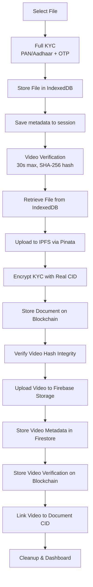
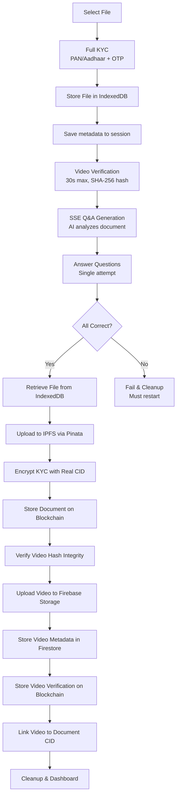

# EviBlock Frontend

Modern Next.js application for blockchain-based document verification with multi-tier KYC, AI-powered questions, video verification, and IPFS storage on the Internet Computer Protocol (ICP).

---

## 📋 Table of Contents

- [Overview](#overview)
- [Architecture](#architecture)
- [Tech Stack](#tech-stack)
- [Getting Started](#getting-started)
- [Project Structure](#project-structure)
- [Data Structures](#data-structures)
- [Document Upload Algorithms](#document-upload-algorithms)
- [AI-Powered Questions](#ai-powered-questions)
- [Security Implementation](#security-implementation)
- [Environment Variables](#environment-variables)
- [Development](#development)
- [Testing](#testing)
- [Troubleshooting](#troubleshooting)

---

## Overview

The EviBlock frontend is a Next.js 16 application built with TypeScript, providing a seamless user experience for uploading, verifying, and managing blockchain-certified documents.

**Key Capabilities:**
- 🔐 Multi-tier document verification (Simple, Evidence, Legal)
- 🎥 Video KYC verification with SHA-256 integrity checks
- 🤖 AI-generated questions with real-time SSE streaming
- 📦 Gated IPFS uploads for high-tier documents
- 🛡️ Strict single-attempt verification policy (Legal tier)
- 🔒 AES-256-GCM encryption for KYC data
- 🧹 Automated sensitive data cleanup on success/failure
- ⛓️ ICP blockchain integration with stable storage
- 🎨 Modern, responsive UI with Tailwind CSS

---

## Architecture

### System Overview

```
┌─────────────────────────────────────────────────────────────┐
│                     EviBlock Frontend                       │
│                   (Next.js 16 + React 19)                   │
├─────────────┬────────────────┬──────────────────────────────┤
│  Client     │   API Routes   │   Libraries                  │
│  Pages      │   (Server)     │   (Shared)                   │
│             │                │                              │
│  /upload    │  /api/qa/*     │  lib/canister.ts (ICP)       │
│  /kyc/*     │  /api/auth/*   │  lib/ipfs.ts (Pinata)        │
│  /dashboard │  /api/contact  │  lib/encryption.ts (AES-256) │
│  /verify    │                │  lib/fileStorage.ts (IDB)    │
│  /about     │                │  lib/secureStorage.ts        │
│  /login     │                │  lib/kycCleanup.ts           │
│  /signup    │                │  lib/qaApi.ts (SSE)          │
└──────┬──────┴───────┬────────┴──────────┬───────────────────┘
       │              │                   │
       ▼              ▼                   ▼
┌────────────┐ ┌─────────────┐  ┌────────────────────┐
│  Firebase  │ │  Pinata     │  │  ICP Blockchain    │
│  Auth      │ │  (IPFS)     │  │  (Canister)        │
│  Firestore │ │             │  │                    │
│  Storage   │ │  CIDv1      │  │  StableBTreeMap    │
│  (Videos)  │ │  Pinning    │  │  FileRecord        │
│            │ │             │  │  VerificationLog   │
│            │ │             │  │  VideoVerification │
└────────────┘ └─────────────┘  └────────────────────┘
```

### Storage Distribution

| Data Type | Storage Layer | Purpose |
|-----------|---------------|---------|
| User Auth | Firebase Auth | Authentication & sessions |
| KYC Video | Firebase Storage | Video blob storage with signed URLs |
| Video Metadata | Firestore | Video proof documents per user |
| Document Files | Pinata/IPFS | Immutable decentralized file storage |
| Document Metadata | ICP Blockchain | Tamper-proof record with encrypted KYC |
| Verification Logs | ICP Blockchain | Audit trail of document verifications |
| Video Verification | ICP Blockchain | SHA-256 hash + Firestore reference |
| Temp Files | IndexedDB | Pre-verification document/video staging |
| Session Data | sessionStorage | Encrypted KYC form data (30-min TTL) |

---

## Tech Stack

### Core Framework
- **Next.js 16.0** - React framework with App Router
- **TypeScript 5.0** - Type-safe development
- **React 19** - UI library

### Styling & UI
- **Tailwind CSS 4.0** - Utility-first CSS
- **Shadcn UI** - Accessible component library
- **Radix UI** - Headless UI primitives
- **Framer Motion** - Animation library
- **GSAP** - Advanced animations
- **Lucide React** - Icon library

### 3D & Graphics
- **React Three Fiber** - React renderer for Three.js
- **@react-three/drei** - Useful helpers
- **Cobe** - Globe visualization

### Blockchain & Storage
- **@dfinity/agent** - ICP blockchain SDK
- **Pinata SDK** - IPFS gateway (CIDv1)
- **@web3-storage/w3up-client** - Web3.Storage alternative

### Firebase Services
- **Firebase Auth** - User authentication
- **Firestore** - Video proof metadata
- **Firebase Storage** - Video file storage

### Forms & Validation
- **React Hook Form** - Form management
- **Zod** - Schema validation (via Shadcn)

### Utilities
- **date-fns** - Date manipulation
- **clsx / tailwind-merge** - Class name utilities
- **react-dropzone** - File upload drag-drop
- **recharts** - Dashboard charts

---

## Getting Started

### Prerequisites

- Node.js 20+
- npm/yarn/pnpm
- Firebase project (Auth + Firestore + Storage)
- Pinata account (IPFS pinning)
- ICP canister (local `dfx` or mainnet)
- Q&A API server (for Legal documents)

### Installation

1. **Install dependencies**
   ```bash
   npm install
   ```

2. **Create environment file**
   ```bash
   cp .env.example .env.local
   ```

3. **Configure environment variables** (see [Environment Variables](#environment-variables))

4. **Start ICP local replica** (if using local canister)
   ```bash
   dfx start --background
   dfx deploy
   ```

5. **Run development server**
   ```bash
   npm run dev
   ```

6. **Open browser**
   ```
   http://localhost:3000
   ```

---

## Project Structure

```
src/evilblock_frontend/
├── app/                           # Next.js App Router
│   ├── about/                     # Landing/about page
│   ├── contact/                   # Contact page
│   ├── dashboard/                 # User dashboard
│   ├── document-type-selection/   # Tier selection page
│   ├── forgot-password/           # Password recovery
│   ├── login/                     # Login page
│   ├── signup/                    # Registration page
│   ├── upload/                    # Document upload
│   ├── verify-email/              # Email verification
│   ├── profile/                   # User profile
│   │
│   ├── kyc/                       # KYC verification flow
│   │   ├── page.tsx               # Full KYC form (Legal/Evidence)
│   │   ├── simple/                # Mini-KYC (Simple tier)
│   │   ├── video-verification/    # Video recording + Evidence finalization
│   │   └── questions/             # AI questions + Legal finalization
│   │
│   ├── api/                       # API routes (server-side)
│   │   ├── auth/                  # Auth helpers
│   │   ├── contact/               # Contact form handler
│   │   └── qa/                    # Q&A API proxy (SSE + verify)
│   │       ├── generate-questions/  # SSE stream proxy
│   │       └── verify-answer/       # Answer verification proxy
│   │
│   ├── globals.css                # Global styles
│   ├── layout.tsx                 # Root layout
│   ├── page.tsx                   # Home page
│   ├── robots.ts                  # SEO robots
│   ├── sitemap.ts                 # SEO sitemap
│   ├── opengraph-image.tsx        # OG image generation
│   └── twitter-image.tsx          # Twitter card generation
│
├── components/                    # React components
│   ├── ui/                        # Shadcn UI components
│   ├── FileUploadForm.tsx         # Main upload logic (Simple vs Gated)
│   ├── FileUploadDropzone.tsx     # Drag-drop upload
│   ├── FileVerification.tsx       # CID verification UI
│   ├── FilesList.tsx              # Document list component
│   ├── DocumentDetailModal.tsx    # Document detail viewer
│   ├── VerificationLogs.tsx       # Verification audit trail
│   ├── KycSecurityProvider.tsx    # Session security wrapper
│   ├── Navbar.tsx                 # Navigation bar
│   └── Footer.tsx                 # Footer component
│
├── lib/                           # Core utilities
│   ├── firebase/config.ts         # Firebase initialization
│   ├── candid/                    # ICP Candid bindings (auto-generated)
│   │   ├── evilblock_backend.ts
│   │   ├── evilblock_backend.did.js
│   │   ├── evilblock_backend.did.d.ts
│   │   └── index.js
│   ├── canister.ts                # ICP blockchain SDK wrapper
│   ├── ipfs.ts                    # Pinata/IPFS upload & CID utils
│   ├── encryption.ts              # AES-256-GCM encryption
│   ├── secureStorage.ts           # Encrypted sessionStorage
│   ├── fileStorage.ts             # IndexedDB file staging
│   ├── kycCleanup.ts              # Sensitive data cleanup
│   ├── qaApi.ts                   # Q&A SSE client
│   └── utils.ts                   # General utilities
│
├── hooks/use-toast.ts             # Toast notification hook
├── types/index.ts                 # TypeScript definitions
├── assets/                        # Static assets
├── public/                        # Public assets
│   └── company_assests/
├── sample/                        # Q&A API test scripts
│
├── .env.local                     # Environment variables (gitignored)
├── next.config.ts                 # Next.js config (CSP headers)
├── firestore.rules                # Firestore security rules
├── storage.rules                  # Firebase Storage rules
├── tsconfig.json                  # TypeScript configuration
└── package.json                   # Dependencies & scripts
```

---

## Data Structures

### Blockchain Records (ICP Canister)

#### FileRecord
Stored on the ICP blockchain via `StableBTreeMap`. Max 4KB per record.

```rust
struct FileRecord {
    id: u64,              // Auto-incremented unique ID
    name: String,         // Original filename
    uid: String,          // Firebase Auth UID of uploader
    date: String,         // Upload date (ISO: YYYY-MM-DD)
    file_type: String,    // MIME type (e.g., "application/pdf")
    file_size: u64,       // File size in bytes (max 100MB)
    cid: String,          // IPFS CID (CIDv1, starts with "bafy")
    timestamp: u64,       // ICP canister time (nanoseconds)
    kyc_detail: String,   // AES-256-GCM encrypted KYC JSON (Base64)
    document_type: String // "simple" | "evidence" | "legal"
}
```

#### VerificationLog
Audit trail for each document verification event. Max 1KB per entry.

```rust
struct VerificationLog {
    id: u64,              // Auto-incremented unique ID
    file_id: u64,         // Reference to FileRecord.id
    cid: String,          // Document CID that was verified
    verifier_uid: String, // Firebase UID of verifier
    verifier_name: String,// Display name of verifier
    timestamp: u64,       // Verification timestamp
}
```

#### VideoVerificationRecord
Links video proof to document. Max 1KB per record.

```rust
struct VideoVerificationRecord {
    id: u64,               // Auto-incremented unique ID
    uid: String,           // Firebase UID of recorder
    video_hash: String,    // SHA-256 hash of video blob (64 hex chars)
    firestore_doc_id: String, // Firestore document ID for video metadata
    document_cid: String,  // Linked document CID (set via link_video_to_document)
    timestamp: u64,        // Recording timestamp
}
```

### Firebase Collections

#### Firestore: `users/{uid}/videoProof/{docId}`
```typescript
{
    videoUrl: string,       // Firebase Storage download URL
    videoHash: string,      // SHA-256 hash (matches blockchain record)
    timestamp: string,      // ISO timestamp
    documentCid: string,    // Linked IPFS CID
    fileName: string,       // Video filename
    fileSize: number,       // Video size in bytes
}
```

#### Firebase Storage Path
```
users/{uid}/videos/{fileName}   // Video blobs (WebM format)
```

### Client-Side Storage

#### IndexedDB: `evilblock-files` → `pendingUploads`
Stores `File` objects for Legal/Evidence documents before IPFS upload.

#### IndexedDB: `evilblock-kyc` → `videoVerification`
Stores video `Blob` + metadata before Firebase Storage upload.

#### sessionStorage (encrypted)
```typescript
_secure_kycFormData  // AES-encrypted KYC form data (30-min TTL)
pendingDocument      // Document metadata awaiting finalization
pendingFileUpload    // File metadata (name, type, size)
videoVerification    // Video hash + metadata
documentType         // "simple" | "evidence" | "legal"
documentStored       // Flag: document stored in IndexedDB
```

### KYC Form Data (encrypted in transit)
```typescript
interface KYCFormData {
    name: string;        // Full name (pre-filled from Firebase Auth)
    email: string;       // Email (pre-filled from Firebase Auth)
    phone: string;       // 10-digit phone number
    address1: string;    // Street address
    address2: string;    // City/State/PIN (optional)
    panCard: string;     // PAN card number (10 chars, OTP verified)
    aadhaarCard: string; // Aadhaar number (12 digits, OTP verified)
}
```

### Simple KYC Data (mini-KYC)
```typescript
{
    name: string;   // Full name
    email: string;  // Email address
    phone: string;  // Phone number
}
```

---

## Document Upload Algorithms

### Simple Documents

**Flow:** Mini-KYC → Upload → IPFS → Blockchain → Dashboard


**Algorithm:**
1. User selects document type "Simple" → redirected to `/kyc/simple`
2. Mini-KYC form: name, email, phone → encrypted in `sessionStorage`
3. Upload page: file selected → **immediately uploaded to Pinata IPFS**
4. Duplicate check: `get_document_by_cid(cid)` on blockchain
5. KYC encryption: `deriveKey(uid + cid)` → AES-256-GCM encrypt
6. Blockchain storage: `store_document_metadata(...)` on ICP canister
7. Cleanup: clear all session data → redirect to dashboard

---

### Evidence Documents

**Flow:** Full KYC → Upload (local) → Video → IPFS + Video Upload → Blockchain → Dashboard



**Algorithm:**
1. User selects "Evidence" → full KYC form with PAN/Aadhaar OTP verification
2. Upload page (`storeOnly=true`): file stored in **IndexedDB** (not IPFS yet)
3. Session metadata saved: `pendingDocument`, `pendingFileUpload`
4. Video verification: user records 30s video reading verification text
5. Video SHA-256 hash generated and stored in `sessionStorage`
6. Video blob stored in IndexedDB (`evilblock-kyc/videoVerification`)
7. **Finalization** (in `video-verification/page.tsx`):
   - Retrieve document from IndexedDB → upload to Pinata IPFS
   - Encrypt KYC data with **real CID** (not placeholder)
   - Store document metadata on ICP blockchain
   - Verify video hash integrity (compare stored vs current SHA-256)
   - Upload video blob to Firebase Storage
   - Store video metadata in Firestore (`users/{uid}/videoProof`)
   - Store video verification on ICP blockchain
   - Link video to document CID on blockchain
   - Cleanup all sensitive data

---

### Legal Documents (Gated Flow)

**Flow:** Full KYC → Upload (local) → Video → AI Questions → IPFS + Video Upload → Blockchain → Dashboard



**Algorithm:**
1. User selects "Legal" → full KYC form with PAN/Aadhaar OTP verification
2. Upload page (`storeOnly=true`): file stored in **IndexedDB** (not IPFS)
3. Session metadata saved with placeholder CID: `pending_{timestamp}_{filename}`
4. Video verification: 30s recording with SHA-256 hash integrity
5. Questions page: AI generates questions from document via SSE stream
   - Document retrieved from IndexedDB → sent to Q&A API
   - Questions streamed in real-time (Q&A + True/False types)
   - Questions randomized for display
6. User answers all questions → **single-attempt verification**
   - Each answer verified via `/api/qa/verify-answer` proxy
   - If ANY answer wrong → **permanent failure**, all data cleared
7. **On all correct** (in `questions/page.tsx uploadFinalDocument`):
   - Retrieve document from IndexedDB → upload to Pinata IPFS
   - Encrypt KYC data with **real CID** (not placeholder)
   - Store document metadata on ICP blockchain
   - Retrieve video blob from IndexedDB → verify SHA-256 hash
   - Upload video to Firebase Storage
   - Store video metadata in Firestore
   - Store video verification on ICP blockchain
   - Link video to document CID on blockchain
   - Cleanup all sensitive data → redirect to dashboard

**Key Design Decision — Deferred Upload:**
> [!IMPORTANT]
> ### ⚠️ Key Architectural Distinction
> - **Simple Docs:** Uploaded to IPFS/Blockchain **IMMEDIATELY** from the upload page.
> - **Evidence Docs:** Saved locally first. Uploaded to IPFS/Blockchain **ONLY AFTER** video verification passes.
> - **Legal Docs:** Saved locally first. Uploaded to IPFS/Blockchain **ONLY AFTER** both video AND Q&A verifications pass.

```text
Traditional Flow (rejected):
Upload → IPFS → Video → Questions → Blockchain
Problem: File on IPFS even if user abandons or fails verification

Gated Flow (implemented):
Upload → IndexedDB → Video → Questions → IPFS → Blockchain
Benefit: Only verified documents consume IPFS storage
```

---

## AI-Powered Questions

**API Proxy Routes:**
- `app/api/qa/generate-questions/route.ts` — SSE stream proxy
- `app/api/qa/verify-answer/route.ts` — Answer verification proxy

**Benefits of Proxy:**
- ✅ Bypasses CORS issues
- ✅ Hides `API_KEY` from client bundle
- ✅ Supports streaming multipart bodies
- ✅ Prevents correct answer leakage in UI feedback

**Client Usage:**
```typescript
import { streamGenerateQuestions, verifyAnswer } from '@/lib/qaApi';

// Streaming question generation
await streamGenerateQuestions(file, 5, (type, data) => {
  if (type === 'question') console.log(data);
  if (type === 'done') console.log('Generation complete');
});

// Answer verification
const result = await verifyAnswer(sessionId, questionId, answer);
// result.is_correct: boolean
// result.feedback: string
```

### Question Types

**Q&A Questions:**
```typescript
{
  id: "q1",
  question: "What is the date mentioned in the document?",
  type: "text",
  required: true,
  placeholder: "Enter date from document",
  sessionId: "session_abc123"
}
```

**True/False Questions:**
```typescript
{
  id: "q2",
  question: "The document was signed by John Doe.",
  type: "boolean",
  required: true,
  options: ["True", "False"],
  sessionId: "session_abc123"
}
```

### UI Rendering
- Text input for Q&A questions
- Radio buttons for True/False
- Type badges (blue for Q&A, green for True/False)
- Real-time verification feedback (green/red borders)
- Validation for required fields

---

## Security Implementation

### KYC Encryption Flow

```typescript
// 1. Derive key from UID + CID using PBKDF2 (100,000 iterations)
const key = await deriveKey(uid, cid);
// Salt: 'evilblock-kyc-salt-v1'
// Hash: SHA-256
// Output: AES-256 key

// 2. Encrypt with AES-256-GCM
const iv = crypto.getRandomValues(new Uint8Array(12));  // 96-bit IV
const ciphertext = await crypto.subtle.encrypt(
  { name: 'AES-GCM', iv, tagLength: 128 },
  key, plaintext
);

// 3. Combine IV + ciphertext → Base64 string
// Stored in FileRecord.kyc_detail on blockchain
```

**Important:** For Legal/Evidence documents, encryption happens **after** IPFS upload, using the **real CID** (not the placeholder). This ensures the decryption key is tied to the actual file content.

### Session Security

**Auto-Expiry:**
```typescript
{
  data: encryptedKycData,
  lastActivity: timestamp // Checked on every access
}

// 30-minute inactivity timeout
if (Date.now() - lastActivity > 30 * 60 * 1000) {
  clearAllData();
  redirectToLogin();
}
```

**Cleanup Triggers:**
- Page unload (`beforeunload`)
- Logout button
- Session timeout (30 min)
- Successful completion
- Verification failure (Legal)

### Video Integrity

```typescript
// 1. Hash on recording
const hash = await crypto.subtle.digest('SHA-256', videoBlob);

// 2. Store hash in sessionStorage
sessionStorage.setItem('videoVerification', JSON.stringify({ videoHash }));

// 3. Verify BEFORE uploading to Firebase Storage
const currentHash = await crypto.subtle.digest('SHA-256', retrievedBlob);
if (storedHash !== currentHash) {
  throw new Error('Security violation: Video tampered');
}
// Only proceeds to upload if hashes match
```

### Content Security Policy (CSP)

Configured in `next.config.ts`:
- `connect-src`: Allows Firebase, Pinata, ICP, Q&A API
- `frame-ancestors: 'none'` — prevents clickjacking
- `X-Frame-Options: DENY`
- `X-Content-Type-Options: nosniff`
- `Referrer-Policy: strict-origin-when-cross-origin`

### Canister Connection

The ICP agent automatically detects local vs production canister hosts:
```typescript
const isLocalReplica = host.includes('localhost') || host.includes('127.0.0.1');
if (isLocalReplica) {
  agent.fetchRootKey(); // Required for local canister only
}
```

---

## Environment Variables

Create `.env.local` in the frontend directory:

```env
# ==========================================
# FIREBASE CONFIGURATION
# ==========================================
NEXT_PUBLIC_FIREBASE_API_KEY=AIza...
NEXT_PUBLIC_FIREBASE_AUTH_DOMAIN=your-project.firebaseapp.com
NEXT_PUBLIC_FIREBASE_PROJECT_ID=your-project-id
NEXT_PUBLIC_FIREBASE_STORAGE_BUCKET=your-project.firebasestorage.app
NEXT_PUBLIC_FIREBASE_MESSAGING_SENDER_ID=123456789
NEXT_PUBLIC_FIREBASE_APP_ID=1:123456789:web:abc123
NEXT_PUBLIC_FIREBASE_MEASUREMENT_ID=G-XXXXXXXXXX

# ==========================================
# PINATA (IPFS) CONFIGURATION
# ==========================================
NEXT_PUBLIC_PINATA_JWT=eyJhbGc...

# ==========================================
# INTERNET COMPUTER (ICP) CONFIGURATION
# ==========================================
# Variable name must match: NEXT_PUBLIC_CANISTER_ID_EVILBLOCK_BACKEND
NEXT_PUBLIC_CANISTER_ID_EVILBLOCK_BACKEND=your-canister-id
NEXT_PUBLIC_IC_HOST=http://127.0.0.1:4943

# Production (mainnet):
# NEXT_PUBLIC_CANISTER_ID_EVILBLOCK_BACKEND=your-mainnet-canister-id
# NEXT_PUBLIC_IC_HOST=https://ic0.app

# ==========================================
# Q&A GENERATION API
# ==========================================
# Server-side only (not exposed to client)
NEXT_PUBLIC_QA_API_URL=http://localhost:9000
API_KEY=your_server_side_api_key

# ==========================================
# EMAIL CONFIGURATION (Server-side)
# ==========================================
EMAIL_SERVER_USER=your-email@gmail.com
EMAIL_SERVER_PASSWORD=your-app-password
EMAIL_SERVER_HOST=smtp.gmail.com
EMAIL_SERVER_PORT=587
EMAIL_TO_ADDRESS=recipient@example.com

# ==========================================
# APPLICATION URL
# ==========================================
NEXT_PUBLIC_APP_URL=http://localhost:3000
```

**Variable Reference:**

| Variable | Purpose | Required For | Side |
|----------|---------|--------------|------|
| `NEXT_PUBLIC_FIREBASE_*` | Auth, Firestore, Storage | All tiers | Client |
| `NEXT_PUBLIC_PINATA_JWT` | IPFS file pinning | All tiers | Client |
| `NEXT_PUBLIC_CANISTER_ID_EVILBLOCK_BACKEND` | Blockchain canister ID | All tiers | Client |
| `NEXT_PUBLIC_IC_HOST` | ICP replica URL | All tiers | Client |
| `NEXT_PUBLIC_QA_API_URL` | AI question generation URL | Legal only | Client |
| `API_KEY` | Q&A API authentication | Legal only | Server |
| `EMAIL_SERVER_*` | Contact form emails | Contact page | Server |

> **Note:** `NEXT_PUBLIC_` variables are embedded at build time. Rebuild after changing them.

---

## Development

### Run Development Server

```bash
npm run dev
```

Open http://localhost:3000

### Build for Production

```bash
npm run build
npm start
```

### Lint Code

```bash
npm run lint
```

### Type Checking

```bash
npx tsc --noEmit
```

---

## Testing

### Q&A API Testing

Test the Q&A generation API:

```bash
cd sample
npm install
node test-qa-api.js
```

**Custom file:**
```bash
node test-qa-api.js /path/to/document.pdf 10
```

See [`sample/README.md`](./sample/README.md) for full testing documentation.

### Manual Testing Checklist

**Simple Documents:**
- [ ] Select "Simple" document type
- [ ] Complete mini-KYC (name, email, phone)
- [ ] Upload PDF → verify IPFS upload succeeds
- [ ] Verify blockchain storage (check dashboard)
- [ ] Verify duplicate CID detection

**Evidence Documents:**
- [ ] Select "Evidence" document type
- [ ] Complete full KYC with PAN/Aadhaar OTP
- [ ] Upload document (verify stored in IndexedDB, NOT IPFS)
- [ ] Record video verification
- [ ] Verify document uploaded to IPFS after video
- [ ] Verify video uploaded to Firebase Storage
- [ ] Verify video metadata in Firestore
- [ ] Verify video verification on blockchain
- [ ] Verify document on blockchain with correct CID
- [ ] Check dashboard shows document

**Legal Documents:**
- [ ] Select "Legal" document type
- [ ] Complete full KYC with PAN/Aadhaar OTP
- [ ] Upload document (verify IndexedDB only)
- [ ] Record video verification
- [ ] Wait for AI question generation (SSE stream)
- [ ] Answer all questions correctly
- [ ] Verify IPFS upload AFTER questions
- [ ] Verify video uploaded to Firebase Storage
- [ ] Verify video verification on blockchain
- [ ] Verify document on blockchain
- [ ] Test failure case: wrong answer → verify cleanup happens

**Production Build:**
- [ ] Run `npm run build && npm start`
- [ ] Repeat upload tests above in production mode
- [ ] Verify no canister certificate errors in console

---

## Troubleshooting

### Common Issues

#### "Failed to fetch" - Q&A API

**Cause:** CORS or CSP blocking

**Solution:**
1. Ensure `next.config.ts` allows your API domain in `connect-src`
2. Restart dev server after config changes
3. Use API proxy route (recommended)

#### "Failed to decrypt KYC data"

**Cause:** Encryption key mismatch

**Solution:**
- For Legal/Evidence docs: Ensure encryption happens AFTER IPFS upload
- Check CID is not placeholder (`pending_*`)
- Verify UID matches the uploader

#### "Verification failed"

**Cause:** Incorrect answer or single-attempt limit reached.

**Solution:**
- Review the document again
- Restart the upload process (all local data is cleared automatically)
- Ensure answers are derived directly from the uploaded file

#### "Questions not ready"

**Cause:** Q&A API processing or connection reset.

**Solution:**
- Check server logs for `ECONNRESET`
- Ensure `NEXT_PUBLIC_QA_API_URL` is correct
- Verify file size is within limits (streaming supports larger files but has timeout limits)

#### "Session expired"

**Cause:** 30-minute timeout exceeded

**Solution:**
- Start process again
- Stay active during verification
- Complete within 30 minutes

#### IndexedDB Errors

**Cause:** Browser storage issues

**Solution:**
- Check browser supports IndexedDB
- Clear browser data if corrupted
- Try incognito mode

#### Canister Calls Fail After Build

**Cause:** Root key not fetched for local canister in production mode

**Solution:**
- Ensure `canister.ts` checks host URL (not `NODE_ENV`) for `fetchRootKey`
- Verify `NEXT_PUBLIC_IC_HOST` is set correctly in `.env.local`
- Rebuild after changing environment variables

---

## Performance Optimization

### Code Splitting
- Dynamic imports for heavy components (Three.js, Firebase Storage)
- Route-based splitting (automatic via Next.js App Router)
- Lazy module loading for canister SDK

### Asset Optimization
- Next.js Image component for optimized images
- Lazy loading for 3D components
- Optimized font loading (Geist)

### Caching Strategy
- Static assets: Long-term cache
- API routes: No cache (real-time data)
- Dynamic pages: ISR where applicable

---

## Deployment

### Vercel (Recommended)

1. Push to GitHub
2. Import to Vercel
3. Add all environment variables
4. Deploy

**Build Command:** `npm run build`
**Output Directory:** `.next`

> **Important:** Set all `NEXT_PUBLIC_*` variables in the Vercel dashboard before deploying. They are embedded at build time.

### Custom Server

```bash
npm run build
npm start
```

Set `PORT` environment variable for custom port.

---

## Canister API Reference

### Update Methods (write to blockchain)

| Method | Parameters | Returns | Purpose |
|--------|-----------|---------|---------|
| `store_document_metadata` | name, uid, date, file_type, file_size, cid, kyc_detail, document_type | `Result<FileRecord, String>` | Store new document |
| `log_document_verification` | cid, verifier_uid, verifier_name | `Result<VerificationLog, String>` | Log verification event |
| `store_video_verification` | uid, video_hash, firestore_doc_id | `Result<VideoVerificationRecord, String>` | Store video proof |
| `link_video_to_document` | video_verification_id, document_cid | `Result<VideoVerificationRecord, String>` | Link video to doc |
| `delete_document` | id | `Result<String, String>` | Admin: delete record |

### Query Methods (read from blockchain)

| Method | Parameters | Returns | Purpose |
|--------|-----------|---------|---------|
| `get_documents_by_uid` | uid | `Vec<FileRecord>` | User's documents |
| `get_all_documents` | — | `Vec<FileRecord>` | All documents (admin) |
| `get_document_by_cid` | cid | `Result<FileRecord, String>` | Find by CID |
| `verify_document` | cid | `Result<FileRecord, String>` | Verify by CID |
| `get_total_documents` | — | `u64` | Document count |
| `get_verification_logs_by_cid` | cid | `Vec<VerificationLog>` | Verification audit trail |
| `get_verification_logs_by_document_id` | document_id | `Vec<VerificationLog>` | Logs by doc ID |
| `get_videos_by_uid` | uid | `Vec<VideoVerificationRecord>` | User's videos |
| `get_video_by_firestore_id` | firestore_doc_id | `Option<VideoVerificationRecord>` | Find by Firestore ID |
| `get_video_by_hash` | video_hash | `Option<VideoVerificationRecord>` | Find by SHA-256 hash |
| `get_video_by_document_cid` | document_cid | `Option<VideoVerificationRecord>` | Find by document CID |

### Validation Rules

| Field | Rule |
|-------|------|
| CID | Non-empty, IPFS format (Qm/bafy/bafk) or 64-char hex SHA-256 |
| File size | 1 byte – 100MB |
| UID | 1–100 characters |
| Filename | 1–255 characters |
| KYC detail | Required for all types, max 2048 chars |
| Document type | Must be "simple", "evidence", or "legal" |
| Duplicate CID | Rejected (unique constraint) |

---

## Support

- **Documentation**: [Root README](../../README.md)
- **Issues**: [GitHub Issues](https://github.com/vibhasdutta/Eviblockv2.0/issues)
- **Email**: vibhasdutta11@gmail.com

---

**Built with ❤️ using Next.js, TypeScript, ICP, Firebase, and Pinata**
