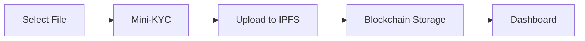
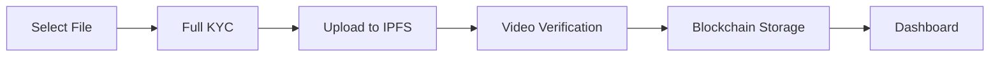
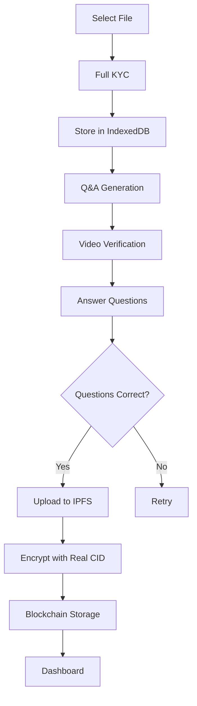

# EviBlock Frontend

Modern Next.js application for blockchain-based document verification with multi-tier KYC, AI-powered questions, and IPFS storage.

---

## 📋 Table of Contents

- [Overview](#overview)
- [Tech Stack](#tech-stack)
- [Getting Started](#getting-started)
- [Project Structure](#project-structure)
- [Key Features](#key-features)
- [Environment Variables](#environment-variables)
- [Document Upload Flows](#document-upload-flows)
- [AI-Powered Questions](#ai-powered-questions)
- [Security Implementation](#security-implementation)
- [Development](#development)
- [Testing](#testing)
- [Troubleshooting](#troubleshooting)

---

## Overview

The EviBlock frontend is a Next.js 16 application built with TypeScript, providing a seamless user experience for uploading, verifying, and managing blockchain-certified documents.

**Key Capabilities:**
- 🔐 Multi-tier document verification (Simple, Evidence, Legal)
- 🎥 Video KYC verification with integrity checks
- 🤖 AI-generated questions for legal documents
- 📦 Deferred IPFS uploads (legal documents)
- 🔒 AES-256-GCM encryption for KYC data
- ⛓️ ICP blockchain integration
- 🎨 Modern, responsive UI with Tailwind CSS

---

## Tech Stack

### Core Framework
- **Next.js 16.0** - React framework with App Router
- **TypeScript 5.0** - Type-safe development
- **React 19** - UI library

### Styling & UI
- **Tailwind CSS 4.0** - Utility-first CSS
- **Shadcn UI** - Accessible component library
- **Radix UI** - Headless UI primitives
- **Framer Motion** - Animation library
- **GSAP** - Advanced animations
- **Lucide React** - Icon library

### 3D & Graphics
- **React Three Fiber** - React renderer for Three.js
- **Three.js** - 3D library
- **@react-three/drei** - Useful helpers
- **@react-three/postprocessing** - Effects

### Blockchain & Storage
- **@dfinity/agent** - ICP blockchain SDK
- **@dfinity/candid** - Candid serialization
- **@dfinity/principal** - Principal management
- **Pinata SDK** - IPFS gateway

### Firebase Services
- **Firebase Auth** - Authentication
- **Firestore** - NoSQL database
- **Firebase Storage** - File storage

### Forms & Validation
- **React Hook Form** - Form management
- **Zod** - Schema validation

### Utilities
- **date-fns** - Date manipulation
- **clsx** - Class name utility
- **react-dropzone** - File upload

---

## Getting Started

### Prerequisites

- Node.js 20+
- npm/yarn/pnpm
- Firebase project
- Pinata account
- ICP canister (local or mainnet)
- Q&A API (for legal documents)

### Installation

1. **Install dependencies**
   ```bash
   npm install
   ```

2. **Create environment file**
   ```bash
   cp .env.example .env.local
   ```

3. **Configure environment variables** (see below)

4. **Run development server**
   ```bash
   npm run dev
   ```

5. **Open browser**
   ```
   http://localhost:3000
   ```

---

## Project Structure

```
src/evilblock_frontend/
├── app/                          # Next.js App Router
│   ├── (auth)/                   # Auth pages group
│   │   ├── login/
│   │   └── signup/
│   │
│   ├── api/                      # API routes
│   │   ├── auth/                 # Authentication
│   │   └── qa/                   # Q&A API proxy
│   │       └── generate-questions/
│   │
│   ├── kyc/                      # KYC verification flow
│   │   ├── page.tsx              # KYC form (Step 1)
│   │   ├── video-verification/   # Video recording (Step 2)
│   │   └── questions/            # AI questions (Step 3 - Legal only)
│   │
│   ├── upload/                   # Document upload
│   ├── dashboard/                # User dashboard
│   ├── about/                    # Landing/about page
│   ├── verify/                   # Document verification
│   └── layout.tsx                # Root layout
│
├── components/                   # React components
│   ├── ui/                       # Shadcn UI components
│   │   ├── button.tsx
│   │   ├── card.tsx
│   │   ├── input.tsx
│   │   └── ...
│   │
│   ├── FileUploadForm.tsx        # Main upload logic
│   ├── FileUploadDropzone.tsx    # Drag-drop upload
│   ├── KycSecurityProvider.tsx   # Session security wrapper
│   └── Navbar.tsx                # Navigation
│
├── lib/                          # Core utilities
│   ├── firebase/                 # Firebase configuration
│   │   └── config.ts
│   │
│   ├── canister.ts               # ICP blockchain SDK
│   ├── ipfs.ts                   # Pinata/IPFS integration
│   ├── encryption.ts             # AES-256-GCM encryption
│   ├── secureStorage.ts          # Encrypted session storage
│   ├── fileStorage.ts            # IndexedDB file storage
│   ├── kycCleanup.ts             # Sensitive data cleanup
│   └── qaApi.ts                  # Q&A API client
│
├── hooks/                        # Custom React hooks
│   └── use-toast.ts
│
├── types/                        # TypeScript definitions
│   └── index.ts
│
├── sample/                       # Q&A API testing
│   ├── test-qa-api.js            # Test script
│   ├── test-package.json         # Test dependencies
│   └── README.md                 # Test documentation
│
├── public/                       # Static assets
│   └── company_assests/
│
├── .env.local                    # Environment variables (gitignored)
├── next.config.ts                # Next.js configuration
├── tailwind.config.ts            # Tailwind configuration
└── tsconfig.json                 # TypeScript configuration
```

---

## Key Features

### 1. Multi-Tier Document Verification

#### Simple Tier
- Mini-KYC (name, email)
- Immediate IPFS upload
- Fast blockchain storage

#### Evidence Tier
- Full KYC verification
- Video recording
- Identity-linked storage

#### Legal Tier
- Full KYC + Video
- **AI-generated questions** from document
- **Deferred IPFS upload** (after verification)
- Highest security level

### 2. Deferred IPFS Upload (Legal Documents)

Legal documents use a special flow to prevent orphaned uploads:

```
Traditional Flow:
Upload → IPFS → Video → Questions → Blockchain
Problem: File on IPFS even if user abandons

New Flow:
Upload → IndexedDB → Video → Questions → IPFS → Blockchain
Benefit: Only verified documents consume IPFS storage
```

**Implementation:**
- File stored in IndexedDB at upload
- Q&A API receives local file
- After questions answered → Upload to IPFS
- Cleanup IndexedDB after success

### 3. KYC Security

**Encryption:**
- AES-256-GCM encryption
- Unique key per document (UID + CID)
- For legal docs: Encrypted AFTER IPFS upload (when real CID available)

**Session Management:**
- 30-minute inactivity timeout
- Encrypted session storage
- Auto-cleanup on logout/timeout/unload

**Security Provider:**
```typescript
<KycSecurityProvider>
  {/* Your app */}
</KycSecurityProvider>
```

### 4. Video Verification

**Features:**
- Browser-based recording (MediaRecorder API)
- SHA-256 hash for integrity
- IndexedDB temporary storage
- Hash verification before upload
- Security violation detection

**Integrity Check:**
```typescript
// Hash during recording
const hash1 = await generateHash(videoBlob);

// Verify before upload
const hash2 = await generateHash(retrievedBlob);
if (hash1 !== hash2) {
  throw new Error('Video tampered');
}
```

### 5. AI-Powered Questions

Legal documents get AI-generated questions:

**Supported Types:**
- **Q&A Questions**: Text-based answers
- **True/False Questions**: Boolean verification

**Features:**
- Question randomization
- Type-specific UI rendering
- Answer validation
- Document content analysis

---

## Environment Variables

Create `.env.local` in the frontend directory:

```env
# ==========================================
# FIREBASE CONFIGURATION
# ==========================================
NEXT_PUBLIC_FIREBASE_API_KEY=AIza...
NEXT_PUBLIC_FIREBASE_AUTH_DOMAIN=your-project.firebaseapp.com
NEXT_PUBLIC_FIREBASE_PROJECT_ID=your-project-id
NEXT_PUBLIC_FIREBASE_STORAGE_BUCKET=your-project.appspot.com
NEXT_PUBLIC_FIREBASE_MESSAGING_SENDER_ID=123456789
NEXT_PUBLIC_FIREBASE_APP_ID=1:123456789:web:abc123

# ==========================================
# PINATA (IPFS) CONFIGURATION
# ==========================================
NEXT_PUBLIC_PINATA_API_KEY=your_api_key
NEXT_PUBLIC_PINATA_SECRET_API_KEY=your_secret_key
NEXT_PUBLIC_PINATA_JWT=eyJhbGc...

# ==========================================
# INTERNET COMPUTER (ICP) CONFIGURATION
# ==========================================
# Local development
NEXT_PUBLIC_BACKEND_CANISTER_ID=rrkah-fqaaa-aaaaa-aaaaq-cai
NEXT_PUBLIC_IC_HOST=http://localhost:4943

# Production
# NEXT_PUBLIC_BACKEND_CANISTER_ID=your-mainnet-canister-id
# NEXT_PUBLIC_IC_HOST=https://ic0.app

# ==========================================
# Q&A GENERATION API
# ==========================================
# For legal document AI questions
NEXT_PUBLIC_QA_API_URL=http://localhost:9000
# or use ngrok: https://abc123.ngrok-free.app

# ==========================================
# EMAIL CONFIGURATION
# ==========================================
NEXT_PUBLIC_MAIL_USER=your-email@example.com

# ==========================================
# APPLICATION URL
# ==========================================
NEXT_PUBLIC_APP_URL=http://localhost:3000
```

**Variable Descriptions:**

| Variable | Purpose | Required For |
|----------|---------|--------------|
| Firebase vars | Authentication, Firestore, Storage | All |
| Pinata vars | IPFS file storage | All |
| ICP vars | Blockchain storage | All |
| QA_API_URL | AI question generation | Legal docs only |
| MAIL_USER | Email notifications | Optional |
| APP_URL | Redirects, emails | All |

---

## Document Upload Flows

### Simple Documents



### Evidence Documents



### Legal Documents (NEW)



---

## AI-Powered Questions

### Q&A API Integration

**Proxy Route:** `app/api/qa/generate-questions/route.ts`

Benefits of proxying:
- ✅ Bypasses CORS issues
- ✅ Hides API credentials
- ✅ Server-side error handling
- ✅ Request logging

**Client Usage:**
```typescript
import { generateQuestions } from '@/lib/qaApi';

const questions = await generateQuestions(file, 5);
// Returns: GeneratedQuestion[]
```

### Question Types

**Q&A Questions:**
```typescript
{
  id: "q1",
  question: "What is the document date?",
  type: "text",
  required: true,
  placeholder: "Enter date from document"
}
```

**True/False Questions:**
```typescript
{
  id: "q2",
  question: "Document was signed by John Doe.",
  type: "boolean",
  required: true,
  options: ["True", "False"],
  correctAnswer: true
}
```

### UI Rendering

Questions page automatically renders:
- Text input for Q&A questions
- Radio buttons for True/False
- Type badges (blue for Q&A, green for True/False)
- Validation for required fields

---

## Security Implementation

### KYC Encryption Flow

```typescript
// 1. Collect KYC data
const kycData = { name, email, phone, address, ... };

// 2. Derive encryption key
const key = await deriveKey(userId + documentCID);

// 3. Encrypt with AES-256-GCM
const encrypted = await encryptKycData(kycData, userId, documentCID);

// 4. Store encrypted data
sessionStorage.setItem('pendingDocument', JSON.stringify({
  ...metadata,
  kyc_detail: encrypted
}));
```

### Session Security

**Auto-Expiry:**
```typescript
// Stored with last activity
{
  data: encryptedKycData,
  lastActivity: timestamp
}

// Checked on every access
if (Date.now() - lastActivity > 30 * 60 * 1000) {
  clearAllData();
  redirectToLogin();
}
```

**Cleanup Triggers:**
- Page unload (`beforeunload`)
- Logout button
- Session timeout
- Successful completion

### Video Integrity

```typescript
// 1. Generate hash on recording
const hash = await crypto.subtle.digest('SHA-256', videoBlob);

// 2. Store hash
sessionStorage.setItem('videoVerification', JSON.stringify({ videoHash }));

// 3. Verify before upload
const storedHash = JSON.parse(sessionStorage.getItem('videoVerification')).videoHash;
const currentHash = await crypto.subtle.digest('SHA-256', videoBlob);

if (storedHash !== currentHash) {
  throw new Error('Security violation: Video tampered');
}
```

---

## Development

### Run Development Server

```bash
npm run dev
```

Open http://localhost:3000

### Build for Production

```bash
npm run build
npm start
```

### Lint Code

```bash
npm run lint
```

### Type Checking

```bash
npx tsc --noEmit
```

---

## Testing

### Q&A API Testing

Test the Q&A generation API:

```bash
cd sample
npm install
node test-qa-api.js
```

**Custom file:**
```bash
node test-qa-api.js /path/to/document.pdf 10
```

See [`sample/README.md`](./sample/README.md) for full testing documentation.

### Manual Testing Checklist

**Simple Documents:**
- [ ] Upload PDF
- [ ] Verify IPFS upload
- [ ] Check blockchain storage
- [ ] View in dashboard

**Evidence Documents:**
- [ ] Complete KYC form
- [ ] Upload document
- [ ] Record video
- [ ] Verify blockchain link

**Legal Documents:**
- [ ] Complete KYC form
- [ ] Upload document (verify local storage)
- [ ] Wait for Q&A generation
- [ ] Record video
- [ ] Answer questions
- [ ] Verify IPFS upload AFTER questions
- [ ] Check blockchain storage

---

## Troubleshooting

### Common Issues

#### "Failed to fetch" - Q&A API

**Cause:** CORS or CSP blocking

**Solution:**
1. Ensure `next.config.ts` allows your API domain
2. Restart dev server after config changes
3. Use API proxy route (recommended)

#### "Failed to decrypt KYC data"

**Cause:** Encryption key mismatch

**Solution:**
- For legal docs: Ensure encryption happens AFTER IPFS upload
- Check CID is not placeholder (`pending_*`)
- Verify UID matches

####  "Questions not ready"

**Cause:** Q&A API still processing

**Solution:**
- Wait up to 2 minutes for API
- Check Q&A API is running
- Verify file format (PDF/image)
- Check API logs for errors

#### "Session expired"

**Cause:** 30-minute timeout exceeded

**Solution:**
- Start process again
- Stay active during verification
- Complete within 30 minutes

#### IndexedDB Errors

**Cause:** Browser storage issues

**Solution:**
- Check browser supports IndexedDB
- Clear browser data if corrupted
- Try incognito mode

---

## Performance Optimization

### Code Splitting
- Dynamic imports for heavy components
- Route-based splitting (automatic)
- Library splitting (Three.js, etc.)

### Asset Optimization
- Next.js Image component
- Lazy loading for 3D components
- Optimized font loading (Geist)

### Caching Strategy
- Static assets: Long-term cache
- API routes: No cache
- Dynamic pages: ISR where applicable

---

## Deployment

### Vercel (Recommended)

1. Push to GitHub
2. Import to Vercel
3. Add environment variables
4. Deploy

**Build Command:** `npm run build`  
**Output Directory:** `.next`

### Custom Server

```bash
npm run build
npm start
```

Set `PORT` environment variable for custom port.

---

## Support

- **Documentation**: [Root README](../../README.md)
- **Issues**: [GitHub Issues](https://github.com/vibhasdutta/Eviblockv2.0/issues)
- **Email**: your-email@example.com

---

**Built with ❤️ using Next.js, TypeScript, and ICP**
